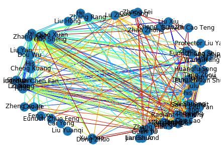

# ChineseLiteratureNetworkGenerator

One of the greatest challenges I faced while reading Romance of the Three Kingdoms was the numerous characters and how their motives exactly fit into the progression of the story. The vast number of characters led to a highly saturated field of important people and each person’s relationship with another person was confusing at times. So, in order to better analyze and understand stories like these, I want to produce a visual summary directly from the narrative. Some machine learning techniques I plan to use are entity recognition, sentiment analysis, and syntactic parsing. 
Process:
We use StanfordCoreNLP for entity recognition and extraction. We use the Python wrapper to start up a server and initialize a client side process to call the server and feed it our text. We store the entirety of the first chapter in a text file. Using a drive package we can import the google drive as a referencable location. We open the file and read it line by line in order for it to not overflow and timeout. We send these lines to the server and build a list of characters by identifying which words return with the term "PERSON" as their mention type. Mentiontypes can recognize location, dates and other values as well, but for our purpose we want to only look at people. 

Format: 
