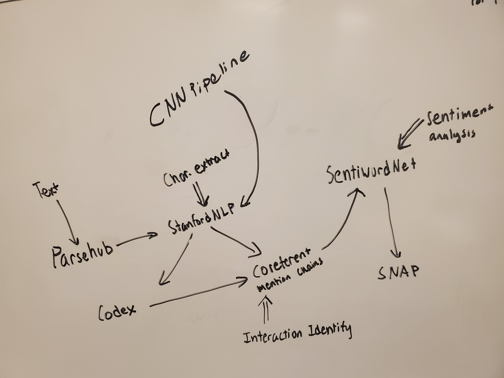

# ChineseLiteratureNetworkGenerator

One of the greatest challenges I faced while reading Romance of the Three Kingdoms was the numerous characters and how their motives exactly fit into the progression of the story. The vast number of characters led to a highly saturated field of important people and each person’s relationship with another person was confusing at times. So, in order to better analyze and understand stories like these, I want to produce a visual summary directly from the narrative. Some machine learning techniques I plan to use are entity recognition, sentiment analysis, and syntactic parsing. 

Process:

We use StanfordCoreNLP for entity recognition and extraction. We use the Python wrapper to start up a server and initialize a client side process to call the server and feed it our text. We store the entirety of the first chapter in a text file. Using a drive package we can import the google drive as a referencable location. We open the file and read it line by line in order for it to not overflow and timeout. We send these lines to the server and build a list of characters by identifying which words return with the term "PERSON" as their mention type. Mentiontypes can recognize location, dates and other values as well, but for our purpose we want to only look at people. 

Once we have built a codex of the people we will again parse through the text and attempt to clean up pronouns such as "he", "she", and "them" and replace them with their referenced proper nouns. We have the codex and clean up any remaining pronouns and take out names with periods as this is an error with how the sentences are being read. 
With this codex we parse again through the resolved reference text and locate sentences that contain more than one character. We send that sentence to SentiWordNet for sentiment analysis. SentiWordNet returns "Positive", "Negative", and "Neutral". We turn this into the values 1, -1, and 0 respectively. 

We have an adjacency matrix where the axis are people and change their edge value to add the sentiment value. Thus largely negative values show a negative relationship and positive values show a positive relationship. We do not want neutral interactions to really affect scores so we will keep them at 0. We build a color list by getting the range of the weights of the graph and applying it to a rainbow gradient. Purple shows more negative and yellow shows positive. The more neutral a relationship is, the closer it is to blue. We use NetworkX to create a graph visualization of the adjacency matrix and relabel the nodes with our codex. 

Obstacles:

Much of the python wrapper has outdated or redacted functions and had to be reprogrammed to make sure the server connected with our client properly. Additionally, the documentation is fairly poor at providing information on the multitude of different client connection methods. The Python wrapper was fairly limited in actual functionality as most of it is Java. However, when attempting to set up the Java version, I ran into many issues with timeout errors and incompatible dependencies. Another obstacle was the fact that each sentiment run took around 30 minutes to parse through the text. The server often would just time out whenever connection was lost. 

Future Works:

Currently coreferent mention chains are just located through a simple checker that only looks at the first 2 characters ran into in a sentence. This is very limiting, but while attempting to search for all characters, the server would reject larger requests. 
